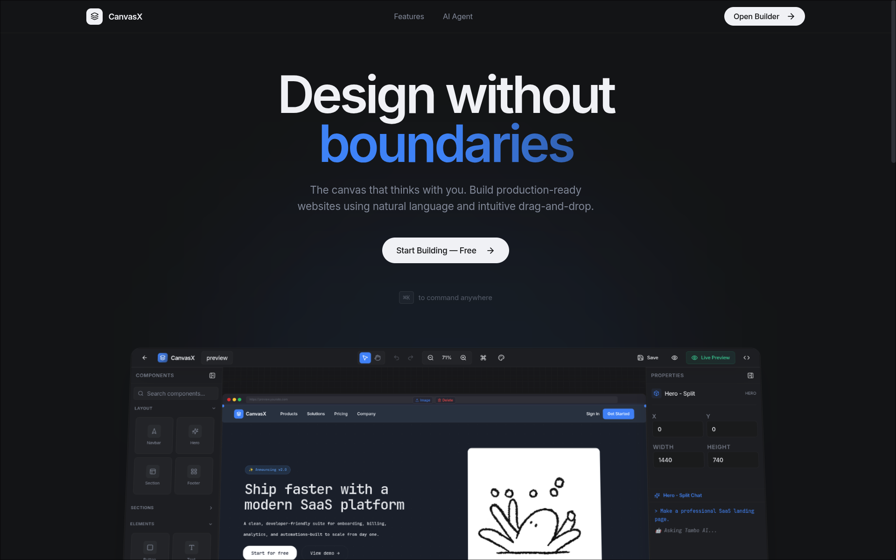

<div align="center">

# CanvasX

[](https://opensource.org/licenses/MIT)
[](https://www.typescriptlang.org/)
[](https://reactjs.org/)

A modern visual website builder with AI-powered design assistance. Build production-ready websites using natural language and intuitive drag-and-drop.


</div>

---

## ✨ Features

- 🎨 **Infinite CanvasX** - Unlimited workspace with precision snap-to-grid
- 🤖 **AI Agent** - Natural language commands for design modifications
- ⚡ **Live Preview** - Real-time rendering of your designs
- 🧩 **Component Library** - Pre-built UI components
- 📦 **Export Code** - Generate clean React/HTML/Tailwind code
- 🎭 **Theme System** - Multiple color palettes with instant switching

---

## 🚀 Tech Stack

- React 18 + TypeScript
- Vite 7
- Tailwind CSS
- shadcn/ui + Radix UI
- Framer Motion
- Tambo AI
- @dnd-kit

---

## ⚙️ Installation

```bash
# Clone repository
git clone https://github.com/yourusername/canvasx.git
cd canvasx

# Install dependencies
npm install

# Set up environment variables
cp .env.example .env
# Add your VITE_TAMBO_API_KEY to .env

# Start development server
npm run dev
```

---

## 📖 Usage

1. **Add Components**: Drag components from the left sidebar onto the canvas
2. **Customize**: Use the right sidebar to adjust properties
3. **AI Assistance**: Press `Cmd/Ctrl + K` for AI commands
4. **Export**: Click "Export" to generate code

---

## 📜 Scripts

```bash
npm run dev       # Start development server
npm run build     # Build for production
npm run preview   # Preview production build
npm test          # Run tests
```

---

## 📁 Project Structure

```
canvasx/
├── src/
│   ├── components/
│   │   ├── builder/          # Canvas builder components
│   │   ├── landing/          # Landing page
│   │   └── ui/               # UI components (shadcn/ui)
│   ├── contexts/             # React contexts
│   ├── lib/                  # Utilities
│   └── pages/                # Page components
└── public/                   # Static assets
```

---

## 📝 License

MIT License - see [LICENSE](LICENSE) file for details.

---

<div align="center">

Made with ❤️ by the CanvasX Team

</div>
